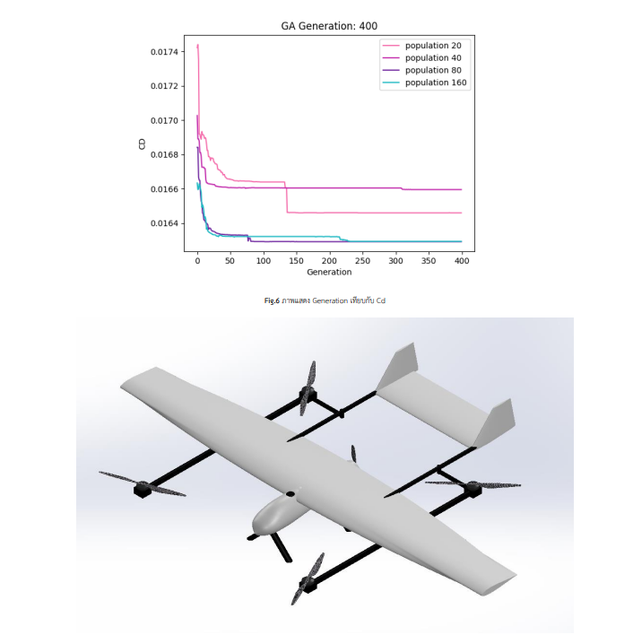

# 🚁 VTOL UAV Design Optimization with Genetic Algorithm

This project aims to design an electric-powered Vertical Take-Off and Landing (VTOL) Unmanned Aerial Vehicle (UAV) for mapping missions using modern optimization techniques.

## 🧪 Objective

- Minimize the Drag Coefficient (Cd) for maximum range.
- Use **Genetic Algorithm** to optimize airframe sizing parameters.
- Validate aerodynamic parameters using **XFLR5** (Low Fidelity).
- Estimate performance metrics such as Thrust Required, Endurance, Range, and Weight.

## 📊 Methodology

1. **Data Collection** from existing VTOL UAVs (Weight, Dimensions, Battery, etc.)
2. **Optimization** using Genetic Algorithm implemented in Python
3. **Validation** via XFLR5 (Lift/Drag/CL/CD simulation)
4. **3D Modeling** with Solidworks 2019
5. **Performance Estimation** (Battery usage, Endurance, Range)

## 📈 Result Highlights

| Parameter                  | Value     |
| -------------------------- | --------- |
| Max Take-Off Weight (MTOW) | 20 kg     |
| Cruise Speed               | 22.5 m/s  |
| Endurance                  | 2.27 hrs  |
| Max Range                  | 184 km    |
| Mapping Area               | 14.66 km² |

Cd from GA = 0.01623  
Cd from XFLR5 = 0.01900  
→ **Error ≈ 14.58%**

## 🧑‍💻 Authors

- Ruangyot Nanchiang
- Sahassawat Rattanamongkolkul
- Kamonlaphat Sitthitharanon

## 🎓 Advisor

- Dr. Atthaphon Ariyarit

## 📄 Thesis Document

[Thesis Document File (TH)](./documents/project_thesis.pdf)
